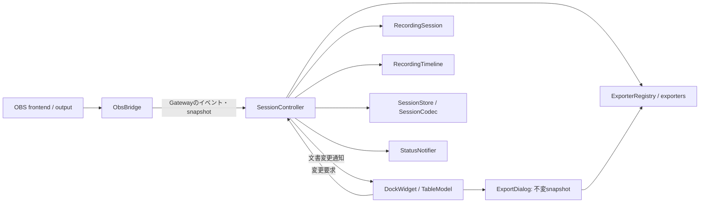

# master 最終コードレビュー（2026-10-02）

## 対象と結論

対象は `master` / `origin/master` の `aa3518be55b8bb10980605b86b69b9e604ade154`。
開始時の作業ツリーはクリーンだった。現行の25実装ファイル、ヘッダー、ビルド設定、CI、3層のテスト、ドキュメントを確認した。
履歴は回帰の判定に使用し、正しさの根拠にはしていない。

通常経路の責務分離と所有権は概ね一貫している。確認済みのCriticalはない。
ただし、保存不能時の文書破棄と古いcacheによる別セッションの上書きはHighとして修正を推奨する。
どちらもリファクタリング以前から引き継いだ問題である。
modeless Exportの再利用に伴う古いsnapshotの使用は、リファクタリングによる確認済みの回帰である。

この段階では本体・既存テスト・CIを変更していない。修正、masterへの統合、pushは行わない。
報告のみを `codex/final-master-review` に記録する。

確度の定義:

- **Confirmed**: 現行コードの明確な経路、設定、または一時再現プログラムで確認。
- **Likely**: 有力な根拠があるが実行条件の確認が残る。
- **Possible**: 条件付きの懸念。実OBS等で成立条件を確認する必要がある。
- **Style / Maintenance**: 動作障害の断定ではなく、明確な単純化・保守性の候補。

## 現在の構造と状態の所有者

|コンポーネント|責務・所有する状態|評価|
|---|---|---|
|`plugin-main` / `PluginRuntime`|OBSへの登録、サービスの生成・終了順序、Dockの寿命|モジュールrootにだけ共有状態を限定。宣言順にbridge/config/exporters/store/controller/notifierを構築し、逆順で破棄する|
|`ObsBridge` / `RecordingGateway`|OBS参照、hotkey、frontend event、outputの世代、現在の取得値|OBSオブジェクトをapplication/core/UIに渡さない。GatewayはFake実装で挙動を試験できる有効な境界|
|`SessionController`|現在の文書、録画timeline、履歴の表示元、復旧済み表示|文書と録画状態のsource of truth。ただし未保存文書の保持方針が不足する（R1）|
|`RecordingSession` / `RecordingTimeline`|メタデータ・marker値、phase・segment origin|Qt/OBS/I/Oに依存しない。録画状態を文書と混同しない|
|`SessionStore` / `SessionCodec`|保存先、journal、cache、JSON変換|文書そのものを所有しない。保存先の決定と失敗時の保護にR2/R3の課題|
|`PluginConfig`|確定済み設定|SettingsDialogの編集値はdraft。保存成功後に公開する|
|`MarkerTableModel`|表示用のmarker projection|UIは変更要求をcontrollerに送り、成功後の通知で表示値を更新する|
|`ExportDialog`|不変の文書snapshot、exporter参照|編集中・録画分割中の安全性に有効。ただしUUIDだけで再利用するためR4が起きる|
|`ExporterRegistry` / 各exporter|8形式の出力、atomicなファイル置換|IExporterは8実装に共通する有効な境界。共通中間モデルの全面導入は不要|
|`StatusNotifier`|OBS status barへの軽量な通知|QPointerを使い、終了時に通知を止める|

OBS workerの`file_changed`はpath/frameをコピーしてbridgeのQt threadにqueueする。
controllerはその通知で前segmentを保存し、timelineを更新し、新文書を作る。
UI操作はcontrollerから文書更新、journalまたはJSON保存、行単位のmodel更新へ進む。
履歴と復旧は別の文書をdecodeし、成功時に現在文書を置換する。
Exportはdialogが取得したsnapshotまたは停止・分割時の文書を使う。

## 問題一覧

|ID|重要度|確度|概要|回帰|
|---|---|---|---|---|
|R1|High|Confirmed|journalとJSONの保存が失敗すると、分割・次回録画開始で最後のメモリ文書を失う|以前から継承|
|R2|High|Confirmed|古いcacheの復旧後の編集が、別セッションのJSONを無確認で置換する|以前から継承|
|R3|Medium|Confirmed|入力値の検証不足と正常な10日超timestampの切り捨て|主な変換挙動は以前から継承|
|R4|Medium|Confirmed|同じUUIDの文書置換後も、前のExport snapshotを再利用する|modeless化・再利用による回帰|
|R5|Medium|Possible|録画activeだがoutputを取得できない場合、既定値のまま打刻可能になる|新しいsnapshot境界の契約が曖昧|
|R6|Medium|Possible|OBSの累積frame数が実ファイル分割の厳密な境界と一致するとは限らない|以前からの方式|
|R7|Medium|Confirmed|CIに回帰テスト実行がなく、format違反も失敗条件にならない|追加したテストがCIに接続されていない|
|I1|Improvement|Confirmed|読み取り専用処理のmarker全コピーと、更新時の候補ごとのコピー|既存のコピーが残存|
|I2|Improvement|Confirmed|2つの250ms timerが毎回同じOBSメタデータを取得する|snapshot化で不要な取得が集約されず残存|
|I3|Improvement|Style / Maintenance|SRT/VTTのcue生成が重複し、VTTの文字列生成にもQt依存が残る|以前からの構造|
|I4|Improvement|Style / Maintenance|未使用API・設定フィールド・到達しないQt5互換処理|旧構造の名残を含む|

### R1: 保存不能時に最後の文書を破棄する

- **場所**: [session-controller.cpp:371](C:/Users/white/Documents/Workspace/obs-timestamp-memo-plugin/src/application/session-controller.cpp:371) `onRecordingFileSplit()`、同ファイル397行 `start_document()`、307行 `onRecordingStarted()`。
- **コード**: `save_ok = store_.finish(...)` / `export_ok = perform_auto_export(...)` の結果に関係なく `start_document(...)` が `session_.replace(...)` を実行する。
- **発生条件**: journal作成・追記が失敗し、旧segmentのJSON保存も失敗する。別形式のauto-exportで救済できていない状態で分割する。または、停止後も未保存の文書がある状態で次の録画を開始する。
- **現在の動作・実害**: 警告は表示するが、唯一残っていた旧markerのメモリ値を破棄する。cacheが作れていない場合は、警告に従ってcacheを探しても復旧できない。
- **確認**: 書き込み不能なsidecarディレクトリをファイルで模擬し、旧文書にメモを追加、新しい有効なpathへ分割した。旧JSONは存在せず、新文書のmarkersは空になった。本体コードの変更なしで再現。
- **回帰**: `d973fca` の旧controllerも、`stop_session()`失敗後に無条件で`start_session()`していた。新設計で生まれた問題ではないが、現行の文書所有者に未保存segmentの保持責務が欠けている。
- **推奨修正**: 保存できなかったsegmentをcontrollerが明示的に保持し、再保存・JSON Exportの対象にできるようにする。OBSの実際の分割は止めず、現在segmentとの区別を表示する。停止後の未保存編集も次の文書置換で消さない。
- **修正リスク**: 中。保持する文書、保存先、通知、Export選択の整合性が必要。無制限のsnapshot保持や、録画イベントを待たせるモーダルは避ける。

### R2: 古い復旧cacheで新しいJSONを上書きする

- **場所**: [session-store.cpp:118](C:/Users/white/Documents/Workspace/obs-timestamp-memo-plugin/src/persistence/session-store.cpp:118) `recover()`、189行の `source_path_.clear()`、73行 `save()`、[session-controller.cpp:234](C:/Users/white/Documents/Workspace/obs-timestamp-memo-plugin/src/application/session-controller.cpp:234) `persist_edits()`。
- **コード**: 復旧後は `source_path_` が空。`save()`はcache内のvideo pathから `<video basename>.json` を選び、`QSaveFile::commit()`後にcacheを削除する。既存JSONのsession IDを確認しない。
- **発生条件**: 同じ動画名に異なるセッションのJSONが存在する一方、古いUUIDのcacheが残っている。その古いcacheを開いてメモを編集する。
- **現在の動作・実害**: 新しいJSONのメモが古い復旧文書に置き換わり、cacheも削除される。ファイル選択や上書き確認を経由しない。
- **確認**: `old-id`のcacheと、同じ動画pathを持つ`new-id`のJSONを作成。cache復旧後に1件編集すると、JSONから`newer-data`が消え、旧cacheも消えた。
- **回帰**: 旧`RecordingSession::save_to_json()`も同じbasenameへのfallbackとcache削除を行っていた。
- **推奨修正**: 復旧文書の保存先を明示し、既存JSONとのID相違・不正JSONを衝突として扱う。別名保存またはユーザーが選んだ上書きに限定する。保存先決定・保存成功までcacheを保持する。同じ文書の正当な更新は許可する。
- **修正リスク**: 中。旧cache・path未解決cache・別名JSON読み込みとの互換性に注意。ID一致だけで全ての新旧衝突を判定できるわけではないため、必要に応じて更新日時等も考慮する。

### R3: 入力値の検証不足と長時間timestampの切り捨て

- **場所**: [session-codec.cpp:23](C:/Users/white/Documents/Workspace/obs-timestamp-memo-plugin/src/persistence/session-codec.cpp:23) `decode_marker()`、74行 `decode()`、[session-store.cpp:154](C:/Users/white/Documents/Workspace/obs-timestamp-memo-plugin/src/persistence/session-store.cpp:154) `recover()`のupdate処理。
- **コード**: `frame_index.toInteger(0)`、不正FPSの既定値、存在しない`label/comment/color`の`toString()`。`schema_version`を書き込む一方、decodeでは検査しない。
- **発生条件**: JSON自体の構文は有効だが、markerの数値が文字列、frameとtimestampが矛盾、updateの必須フィールドが欠落、対応外schema等。
- **現在の動作・実害**: 読み込みを成功扱いし、frame/timecodeと秒表示系Exportが食い違う。復旧updateは元のlabel/commentを空にする。その後の編集保存で、破損した値が確定されうる。
- **確認**: `timestamp_ms=2000`のmarkerの`frame_index`を`"damaged"`、schemaを`99.0.0`にしてdecode。成功し、frame=0・timestamp=2000が共存した。`{"op":"update","id":1}`を完全なjournal行として追加した復旧も成功し、label/commentが空になった。
- **正常データの境界条件**: `raw_ms <= 864000000`という制限により、10日を超える有効な録画時刻も0へ変わる。60fpsの`frame_index=51840060`（10日と1秒）を通常のdomain APIで作成してencode/decodeすると、frameは維持されtimestampだけ0になった。通常の数時間録画では発生しないが、corrupted fileに限った問題ではない。
- **回帰**: clamp・既定値化の大半は旧実装から継承。codec抽出によって厳密な検証境界ができたわけではない。
- **推奨修正**: 必須フィールドの型・範囲とframe/timestampの整合性を検証し、不正なら元文書を変更せず失敗する。有効な長時間値を破壊しない上限を定義するか、frameを基準にtimestampを復元する。新しいschemaは拒否または明示的移行をする。legacy cacheのschema欠落やID補修等、実際に必要な互換処理は別の許可ルールとして維持する。部分updateを許すなら、欠落フィールドを既存値で維持する仕様を明記する。
- **修正リスク**: 中。過去データを一律拒否しないこと。ms丸め誤差は許容範囲を定義し、正常な有理数FPSデータを拒否しない。

### R4: 文書が変わっても同じUUIDなら古いExportを使う

- **場所**: [dock-widget.cpp:305](C:/Users/white/Documents/Workspace/obs-timestamp-memo-plugin/src/ui/dock-widget.cpp:305) `onExportClicked()`、[export-dialog.hpp:18](C:/Users/white/Documents/Workspace/obs-timestamp-memo-plugin/src/ui/export-dialog.hpp:18) `session_id()` / `const RecordingSession session_`。
- **コード**: `export_dialog_->session_id() != session.session_id()` の場合だけdialogを作り直す。
- **発生条件**: Exportを開いたまま、同じUUIDを持つ別名JSON・別revisionのJSONを読み込んで再度Exportを押す。またはExportを開いた後の編集結果を、再度Exportを押すことで取得しようとする。
- **現在の動作・実害**: tableは新しい文書なのに、dialogのタイトル・出力・Clipboardは以前のsnapshotのまま。dialogを閉じて開き直すまで更新されない。
- **確認**: 同一UUIDでメモが`snapshot-A`と`snapshot-B`の2文書を作成。AでExportを開き、BをロードしてExportを押してCopyするとAがコピーされた。
- **回帰**: 不変snapshot自体は安全上有効。新しいmodeless dialogをUUIDだけで再利用する方式が更新漏れを導入した。
- **推奨修正**: 現在文書のrevisionまたはロード世代を明示し、再度のExport操作で新しいsnapshotを取得する。開いているdialogの保存処理中にはsnapshotを勝手に置換しない。必要なら取得時点の表示・軽量な更新操作を用意する。
- **修正リスク**: 中。ファイル選択dialogの入れ子event loop中に文書が変わっても、安全な不変snapshotを使う性質を維持する。

### R5: output取得不能を正常な0 frameと区別できない

- **場所**: [obs-bridge.cpp:110](C:/Users/white/Documents/Workspace/obs-timestamp-memo-plugin/src/obs/obs-bridge.cpp:110) `attach_recording_output()`、293行 `snapshot()`、[recording-gateway.hpp:5](C:/Users/white/Documents/Workspace/obs-timestamp-memo-plugin/src/application/recording-gateway.hpp:5) `RecordingSnapshot`。
- **発生条件**: frontendは録画activeだが、録画開始・途中ロード時のoutput取得がnullptrになる。通常のOBS開始経路で実際に成立するかは未確認。
- **現在の動作・実害（条件付き）**: snapshotは`recording=true`とframe=0/default FPSを返し、controllerは録画状態として打刻を許可する。output再取得の経路もないため、0秒のmarkerが続く可能性がある。
- **回帰**: snapshot境界は「正常な既定値」と「取得不能」を区別しない。以前からのnullptr fallbackも関係するため、実際の新規障害とは断定しない。
- **推奨修正**: まずstubに取得失敗を注入して期待動作を定義する。必要ならsnapshotに取得可否を表し、打刻を拒否して警告する。再取得する場合はactiveが確定した後の安全なタイミングに限定する。
- **修正リスク**: 中。起動時のoutput取得クラッシュを再導入しないこと。0 frameの正常な録画直後を取得失敗として扱わない。

### R6: 分割originのframe精度は実muxerに依存する

- **場所**: [obs-bridge.cpp:134](C:/Users/white/Documents/Workspace/obs-timestamp-memo-plugin/src/obs/obs-bridge.cpp:134) `on_file_changed()`、[recording-timeline.hpp:29](C:/Users/white/Documents/Workspace/obs-timestamp-memo-plugin/src/core/recording-timeline.hpp:29) `split()`。
- **コード**: OBSの`file_changed(next_file)` callback内で`obs_output_get_total_frames()`を取得し、次segmentのoriginにする。
- **発生条件**: interleaved出力、encoder buffering、音声packetを起点とする分割等。実際の誤差は未測定。
- **根拠・条件付きの実害**: OBSのmuxerにはpacket時刻を使う分割処理があり、`next_file`通知の累積frame数が「新ファイルの第1 video frame」と等しい保証はこのコードにない。1frameまたはbuffered frame分のずれがNLE用markerに出る可能性がある。
- **回帰**: 以前からのsegment origin算出方式。FakeGatewayのframe offsetを指定するテストは、そのoffsetの適用しか検証しない。
- **推奨修正**: frame番号を焼き込んだ録画で実ファイル境界とmarkerのframeを測定する。誤差が確認された場合に、muxerの時刻・packetの仕様に合わせて設計する。根拠なく`±1`する修正は避ける。
- **修正リスク**: 高。OBS版、muxer、encoder、audio interleaveで挙動が異なり、一方の形式だけを直す可能性がある。
- **一次資料**: [OBS ffmpeg muxer](https://github.com/obsproject/obs-studio/blob/32.2.1/plugins/obs-ffmpeg/obs-ffmpeg-mux.c)。ローカルのOBS 31.1.1のsignal/packet処理も確認した。

### R7: CIが回帰とformat違反を止めない

- **場所**: [.github/workflows/check-format.yaml:15](C:/Users/white/Documents/Workspace/obs-timestamp-memo-plugin/.github/workflows/check-format.yaml:15)、[tests/CMakeLists.txt:1](C:/Users/white/Documents/Workspace/obs-timestamp-memo-plugin/tests/CMakeLists.txt:1)。ビルドworkflowにはtestsのconfigure/build/ctest呼び出しがない。
- **コード**: clang-formatとgersemiの`failCondition: never`。format actionも`--fail-never`を渡す。
- **発生条件・実害**: 起動・所有権・状態遷移の回帰やformat違反が混入しても、コンパイルできれば現在のCIが緑になりうる。今回のR1～R4も既存のローカルテストでは検出されない。
- **確認**: workflowとformatスクリプトを追跡。現行HEADのCIは成功しているが、テスト実行成功を意味しない。
- **回帰**: template由来のformat設定は以前から存在。リファクタリングで作成した有効な回帰テストがCIに接続されていない。
- **推奨修正**: domainをQt不要のjobで実行し、Qt/OBS stubテストも少なくとも1OSで実行する。可能なら3OSで実行する。CTestのminimal/PATH設定を使う。formatは使用版を固定し、対象差分の違反を失敗条件にする。
- **修正リスク**: 低～中。CIのQt platform plugin配置と依存パス、既存のformat差分を先に確認する。一括の書式変更は不要。

## 不要な処理を減らす候補

### I1: 読み取り専用vectorコピーと更新時のコピー

- **場所**: [csv-exporter.cpp:37](C:/Users/white/Documents/Workspace/obs-timestamp-memo-plugin/src/exporters/csv-exporter.cpp:37)、[edl-exporter.cpp:47](C:/Users/white/Documents/Workspace/obs-timestamp-memo-plugin/src/exporters/edl-exporter.cpp:47)、[xml-exporter.cpp:82](C:/Users/white/Documents/Workspace/obs-timestamp-memo-plugin/src/exporters/xml-exporter.cpp:82)、[text-formats.cpp:121](C:/Users/white/Documents/Workspace/obs-timestamp-memo-plugin/src/exporters/text-formats.cpp:121)、controllerの143/155/183行。
- **内容**: `get_markers()`はconst参照を返すが、`auto markers = ...`がvector全体をコピーする。CSV/EDL/XML/Markdownと削除前の探索にはコピーが不要。更新では`for (auto candidate : ...)`により該当markerに到達するまで全候補の文字列をコピーする。
- **条件・実害**: marker・メモが多いと、不要なallocationと文字列コピーが増える。通常の小規模データで致命的な性能問題とはしていない。
- **推奨**: 読み取りは`const auto &`、変更候補は該当markerだけコピーする。削除は必要なrow/IDを取得してからvectorを変更する。重複した探索も、単純なlookupで減らせる範囲だけ整理する。
- **回帰**: 値返しだった旧getterの利用方法が、参照返しへの変更後も残る。必須snapshotとは異なるコピー。
- **リスク**: 低。削除後のiterator/referenceを使用しないこと。SRT/VTT/YouTubeのsort用コピーはそのまま維持できる。

### I2: OBSの全snapshotを定期的に重複取得する

- **場所**: [session-controller.cpp:88](C:/Users/white/Documents/Workspace/obs-timestamp-memo-plugin/src/application/session-controller.cpp:88) `current_record_ms()`、287行 `check_recording_file_changed()`、[dock-widget.cpp:232](C:/Users/white/Documents/Workspace/obs-timestamp-memo-plugin/src/ui/dock-widget.cpp:232) `updateLiveTimer()`、bridgeの293行 `snapshot()`。
- **内容**: controllerのpollとDockのtimerは各250ms。録画中、全snapshotを合計約8回/秒取得する。毎回FPS、encoder、寸法まで取得するが、timerの目的はframeまたはpathである。打刻でもpath確認とframe取得の2回snapshotを取る。
- **条件・実害**: 不要なAPI取得と同じメタデータの再計算。測定していないCPU削減量は主張しない。
- **推奨**: outputを安全に取得した時点で安定したFPS/寸法をbridgeに保持し、snapshotは更新が必要な値だけ取得する。同一操作のcaptureを適切に再利用する。単純化できるならpath解決後のpoll頻度も見直す。
- **リスク**: 低～中。output/encoder切り替え時にcacheを無効化する。pending splitを処理した後のframeと文書の整合性を保つ。細かいgetterを大量に追加する改善は推奨しない。

### I3: SRT/VTTの小さな共通化

- **場所**: [srt-exporter.cpp:28](C:/Users/white/Documents/Workspace/obs-timestamp-memo-plugin/src/exporters/srt-exporter.cpp:28)、[vtt-exporter.cpp:16](C:/Users/white/Documents/Workspace/obs-timestamp-memo-plugin/src/exporters/vtt-exporter.cpp:16)。
- **内容**: sort、開始・終了時刻、同時刻の1秒fallback、label/comment連結を両形式で繰り返す。VTTの文字列生成はQStringのescapingに依存する。
- **推奨**: 字幕cue計算を直す機会があれば、純粋な小さなcue helperとして共通化する。format固有のescaping/BOM/改行は各exporterに残す。全8形式の大きな中間表現は導入しない。
- **条件・実害**: 今回は障害を確認していない。将来一方だけ修正して字幕の挙動がずれるリスクを減らす候補。
- **リスク**: 中。pause中に同時刻markerが複数ある場合の重なりは仕様を決め、外部playerでも確認する。重なりがあるだけで直ちに不正字幕とは断定しない。

### I4: 未使用・旧互換APIの整理

- **場所**: [session-store.hpp:11](C:/Users/white/Documents/Workspace/obs-timestamp-memo-plugin/src/persistence/session-store.hpp:11) `set_cache_directory()`、[exporter-registry.hpp:15](C:/Users/white/Documents/Workspace/obs-timestamp-memo-plugin/src/exporters/exporter-registry.hpp:15) `find_by_extension()`、[settings-dialog.hpp:18](C:/Users/white/Documents/Workspace/obs-timestamp-memo-plugin/src/ui/settings-dialog.hpp:18) `settingsSaved()`、[plugin-settings.hpp:5](C:/Users/white/Documents/Workspace/obs-timestamp-memo-plugin/src/core/plugin-settings.hpp:5) `MarkerTypeConfig`。
- **判断根拠**: repository検索ではsetter/extension検索に呼び出しがない。`settingsSaved`はemitするがreceiverがなく、UI同期は`configChanged`で行う。`MarkerTypeConfig::type_index/hotkey_name`は初期値以外で読まれず、slot番号とbridgeの安定名が実際に使われる。
- **その他**: `RecordingSession::metadata()`、`RecordingTimeline::phase()`は現在利用されない。Qt6必須のCMake構成で、exporterのQt5 codec分岐とExportDialogの5.15未満signal分岐は到達しない。
- **推奨**: 外部向けの公開ABIではないことを確認して、実際に不要なものだけまとめて削除する。controllerのauto-export/pollの公開範囲も必要に応じて絞る。
- **実害・回帰**: 現状の動作障害はない。旧設計の名残を含む保守性の問題であり、High/Mediumより先に変更しない。
- **リスク**: 低。テスト専用の入口・互換対象を確認する。値型のgetterが少し残ること自体は問題としない。

## 修正不要と判断した構造・処理

- **UIのmarkerコピー**: TableModelは表示projectionとして値を保持する。`setData()`はcontrollerに要求を送り、controllerの通知で確定値を更新するため、独立したsource of truthではない。共有可変vectorへの置換は不要。
- **UI再構築**: add/update/deleteは行単位。全文書resetは開始・分割・ロード・clearに限る。文書変更のたびにtable全体を再構築する設計ではない。
- **Export snapshot**: 文書編集、分割、modeless操作、file dialogの入れ子event loopから出力対象を保護するため必要。削除せずR4の鮮度判定を修正する。
- **journal + 停止時JSON**: 逐次復旧と扱いやすい最終ファイルの両方を提供する。二重保存には目的がある。
- **journalのflush**: QTextStreamとQFileの両方にflushするのはbuffer層を通過させるため。打刻の耐障害性を下げる単純な間引きは推奨しない。電源断時の完全永続性まで保証した設計ではない。
- **atomic保存**: QSaveFileを使用し、write/stream/commit失敗を確認している。途中のJSONで既存ファイルを置換しない。ただし別文書の上書き防止とは別問題（R2）。
- **settings draft**: dialogの編集値と確定設定の分離は有効。保存失敗時にlive設定を公開しない。単にコピーがあるという理由で統合しない。
- **Gateway/interface**: productionとFakeの双方があり、OBS APIをapplication/coreから隔離する。IExporterにも8実装がある。抽象化削除の対象ではない。
- **Runtime所有順**: cleanupでcallback/timerを停止し、残るviewを削除してからサービスを破棄する。終了・再ロードのstubテストも確認した。
- **OBS reference**: outputは開始後に取得し停止まで保持、detachでsignal解除とrelease。settings/data arraysの取得も対応するreleaseがある。encoderはoutputから借用し、この経路でreleaseしない。
- **worker callback**: `file_changed`はUIを直接変更せず、bridge contextにqueueする。output generationで旧queueを無効化する。OBSのsignal handlerのmutexとdisconnectの同期を確認し、workerからheld outputを読むことだけでUAFとは判断しなかった。
- **hotkey/callback解除**: bridgeの登録解除とcontrollerのdisconnect、QObject context付きqueue、posted event処理があり、通常経路の解除漏れ・接続増殖を確認していない。
- **Dock階層**: OBSの外側QDockWidgetの子は内容QWidget。内部にQDockWidget/QMainWindowを重ねていない。Settings/Exportは内容widgetをparentにしたmodeless QDialogでQPointer管理する。
- **static state**: module rootのruntime・Dock・登録flagはOBSのCエントリポイントに対応する。新たなsingleton導入や、そのための追加抽象化は不要。
- **安全な整形変更**: includeの順序、rename、ファイル分割等は今回の修正提案に含めない。所有する値型メンバのヘッダーはcomplete typeが必要であり、forward declaration化を目的にしない。

## 全exporterの確認

|形式|確認した設計・注意点|
|---|---|
|JSON|共通codec、atomic保存、schema出力。入力検証とschema読取はR3|
|CSV|UTF-8 BOM、quote/二重quoteによるescape、timecode/frame列。不要コピーはI1|
|EDL|label/commentの改行・tabを単一行へ変換、DF/NDF timecode、atomic保存。NLE取込みは未実施|
|SRT|UTF-8 BOM、時刻sort、cue計算、改行の正規化。大量の同時刻markerは外部playerで確認が必要|
|VTT|header、時刻sort、`& < >` escape、文字列/ファイル出力。cue共通化はI3|
|YouTube|時刻sort、同じ秒の統合、先頭0秒。外部サービス側の採用条件はこのコードのテスト対象外|
|Markdown|表セルの改行・区切り処理、shared pure text生成。読み取り専用コピーはI1|
|XML|XML escapeと制御文字除外、frame/timebase、atomic保存。対象NLEのformat対応は未確認|

空文書への出力、Clipboardのsnapshot、分割後の出力対象、UTF-8、Windowsのtext改行をコード上で確認した。
UIはmarkerがない場合Exportを無効にする。字幕のsort用コピーは入力を変更しないために有効。
各形式は停止・分割時の同じ文書を使う。秒系とframe系の不一致はR3の不正入力経路で再現した。
Copy成功時のモーダルは存在せず、失敗時の通知は維持されている。

## 検証結果と限界

|項目|結果|
|---|---|
|Windows実プラグインbuild|現行HEADを既存`build_x64`で再ビルド成功（RelWithDebInfo、MSVC）|
|既存tests build / CTest|domain / application / regressions の3件すべて成功。QtはCTestのminimal/PATH設定で実行|
|再現プログラム|現行の全実装をOBS stubとリンク。MSVC `/W4 /WX`で新規コンパイル成功。6条件で上記の問題挙動をassertし、全て再現|
|Clang静的解析|25実装ファイルをcore/cplusplus/deadcode analyzerで確認。errorなし。Qt-owned layoutの警告1件を所有権確認で誤検知と判断|
|GitHub Actions|[run 36901779799](https://github.com/oz-coden/obs-timestamp-memo-plugin/actions/runs/36901779799)、head=`aa3518b`。Windows/macOS/Ubuntu buildとformat 2jobがsuccess|
|ローカルC++ format|clang-format 22.1.8のread-only検査でXML exporter 17行の折り返し1件。CIの19系と版が異なるため同一条件の結果ではない。書式は変更せず、runtime bugともしていない|
|CI formatの強制性|`failCondition: never`なのでgreenは全ファイルの厳密なformat適合を保証しない。R7|
|Git diff review|本体・tests・CIの差分なし。レビュー文書のみを変更|
|実OBS|今回のレビューでは新たに起動・録画を実施していない。ユーザー確認済みの正常起動・打刻・Export・Copyを前提として区別|

再現プログラムはignoredの `.cache/final-review-probes`、buildは `.cache/final-review-build` に置き、実際のOBS設定やユーザーデータを使っていない。
R1はvideo本体の書き込み不能ではなく、プラグインsidecarの失敗を模擬したもの。録画中の権限変更、容量不足、path未解決等の実OBS条件は別途確認が必要。
問題をassertするプログラムが成功したことは、不具合が修正されたことを意味しない。

Clangのlayout警告対象は `ExportDialog::setup_ui()` の `new QVBoxLayout(grp)`。
parentのQGroupBoxが所有し、dialog破棄時のlayout QPointer消滅も既存回帰テストで検証している。
Windows ClangではOBS 31.1.1ヘッダー用の宣言だけの`analyzer-compat.hpp`を使った。これは本体にはリンクしない。
静的解析はdata race、実muxer、外部NLE動作の証明にはならない。

## クロスプラットフォームの評価

- 使用しているFPS divisor取得APIは、READMEの最低要件である[OBS 31.0の公開ヘッダー](https://github.com/obsproject/obs-studio/blob/31.0.0/libobs/obs.h)にも存在する。今回、新しいOBS APIへの無条件依存を追加したわけではない。
- pathはQtのQFileInfo/QDirとUTF-8のQString/std::string変換を経由する。Windows固有の区切り文字の手組みは主な保存経路にない。動画名からの保存先衝突はOSに関係なくR2として残る。
- frame/msには固定幅整数、JSONにはqint64、printfには明示的なunsigned long long変換を使う。MSVC/LP64のunsigned long幅差による確認済みの不具合はない。ただしR3の独自上限はプラットフォームに関係なく有効値を壊す。
- Qt6のQTextStreamはUTF-8を使い、CSV/SRTのBOMは明示する。text modeの改行差はありうるが、今回不正出力とは確認していない。外部NLE/playerでの実入力は残る。
- ClangのQJsonArray参照警告は現行HEADで値受けに修正済み。全OSのCI buildは成功した。macOS/Ubuntuのruntime、native clipboard、Qt window配置はbuildの成功だけでは確認できない。
- Qt platformの初期化エラーについて、今回はCTest経由のminimal環境で既存回帰テストと再現プログラムを正常実行できた。以前のGUIエラーの原因を断定したものではない。

## テスト不足と推奨する追加テスト

優先度順に、内部クラスの形ではなく次の挙動を検証する。

1. **保存失敗 + 分割/次の開始**: 未保存旧文書を取り出して再保存でき、新文書と混同しない。journal健全/不健全とJSON有効/無効を組み合わせる。
2. **古いcache + 既存JSON**: 別IDや不正JSONを無断で変更しない。衝突時もcacheを保持し、別名保存後にだけ削除する。
3. **意味的corruptionと長時間**: 型・必須値・frame/ms不一致・unsupported schema・不完全updateで元文書を変更しない。10日境界と旧schema/cacheの互換成功も対にする。
4. **snapshot鮮度と寿命**: 同一UUIDの別revisionを開く、同じsessionで編集後に再Export、ファイル選択中に録画分割/終了。現在文書を使う操作と、既取得snapshotを維持する操作を区別する。
5. **output取得失敗**: module load/録画前/停止後のoutput queryが0、録画active時のnullptrで不正な打刻をしない。
6. **worker queueと終了**: 旧output generationの遅延通知、停止→再開始、EXIT/unload前後、hotkeyの遅延queue。実際のOBS mutex/threadモデルはstubだけでは証明しない。
7. **export内容**: 空文書、同時刻、複数行、Unicode、長いメモを各形式で検証。ファイルが存在するだけでなくparser/期待内容を確認。DFの分境界・10分境界・長時間、FPS divisor、各segmentの0 frameを維持する。
8. **クロスプラットフォーム実行**: CTestを3OSで回す。path/UnicodeとQt platform pluginの差異を含める。CMake formatはC++とは別の使用版・失敗条件で確認する。

既存テストは、録画前output非取得、起動失敗rollback、reload、EXIT、held reference解放、pending splitの停止前処理、pause/resume、正常split、戻ったoffsetの拒否、別名JSONへの編集保存、JSON構文破損、末尾torn cache、BOM、XML制御文字、モデル再入、snapshot独立、Clipboard非モーダルを既に扱う。
今回の不足はテスト数の少なさ全般ではなく、失敗をまたぐ状態遷移と外部実行境界である。

## 実OBSで再確認する手順

安全なコピーと専用のテスト録画フォルダを使用する。重要な既存JSON/cacheでは衝突試験をしない。

1. OBSを再起動しDockを表示、dock/floatを切り替える。内容widgetが1つで、内側のタイトルバーやDockがないことを確認する。
2. hotkey設定を保存し再起動、4種の打刻とメモfocus、メモ保存・種別変更・編集・削除を確認する。設定も再起動後に復元することを確認する。
3. 録画開始直後、pause中、resume直後、停止直前に打刻する。pause中は時刻が進まずpaused印があり、再開・停止後のUI状態が正しいことを確認する。
4. frame番号を焼き込んだ録画を、通常FFmpeg系と対応するMP4系の分割出力で実施する。自動/手動分割、encoder FPS divisor、音声ありを試し、各ファイルの最初のvideo frameとmarkerのframeを突き合わせる。R6の実測として誤差を記録する。
5. 分割直前/直後と停止直前に連続打刻し、前後のJSON/cache/exportに正しいmarkerが属することを確認する。
6. Exportを開き、文書を編集する。同じUUIDを持つ別revisionのJSONをロードして再Exportし、タイトル・内容・Clipboardが選んだ文書と一致することを確認する（現状R4は未修正）。
7. ファイル選択中の録画開始/分割/OBS終了、Settings/Exportを開いたままのOBS終了を確認する。クラッシュや重複ウィンドウがないことを確認する。
8. テストデータだけで古いcacheと異なるIDのJSONを用意し、復旧編集時の衝突保護を確認する（現状R2は未修正）。cacheだけ/末尾torn/途中破損も試す。
9. 修正後、sidecar保存失敗を安全に注入し、分割・停止・次回開始でも未保存文書が残り、別名Exportで救済できることを確認する。実環境全体を容量不足にする試験は不要。
10. CSVを表計算、SRT/VTTをplayer、EDL/XMLを対象NLEに読み込む。日本語・絵文字・改行・記号とDF/segment位置を確認する。Clipboard成功にOK操作が不要なことも確認する。

## 修正の選定

次段階では以下の論理単位を推奨する。今回その修正は行っていない。

1. **未保存文書の保持（R1）**: failure→split/startの回帰テストと保持・再保存処理。
2. **復旧保存の衝突保護（R2）**: 保存先決定、cache保持、別名保存、既存データ非破壊のテスト。
3. **入力検証（R3）**: schema/legacy規則、必須値と整合性、transactional decode/recover。
4. **Export鮮度（R4）**: 文書revision/ロード世代とsnapshot寿命のテスト。
5. **検証をCIへ接続（R7）**: testsとformatの失敗条件を明示。
6. **低リスクの単純化（I1/I2）**: 参照利用・必要値だけのcapture。各変更でbuild/CTest/format/static analysis/diffを確認する。

R5/R6はまず成立条件を確認し、裏付けのない挙動変更を避ける。
I3/I4は関連処理を修正する機会に限定してよい。全面的な再設計、rename、フォーマット一括変更は不要。
重大なメモリ所有権の問題を確認していないため、現在のRuntime/Gateway/model projectionを作り直すことは推奨しない。
