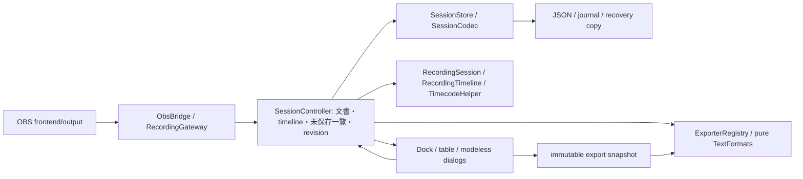

# 最終レビュー指摘の修正（2026-10-02）

基準はmaster/origin/masterの`aa3518be55b8bb10980605b86b69b9e604ade154`。開始時のworking treeはclean。`codex/fix-final-review`をmasterから作成し、既存レビュー文書のcommit `82fe899`をfast-forwardで取り込んだ。[レビュー原文](final-master-review.md)の問題IDを使用する。履歴のrebase/squash/amend/force pushは行っていない。

## 対応結果

| ID | 結果 | 原因と修正 |
|---|---|---|
| R7 | 修正した | build workflowがCTestを実行せず、formatもfailCondition:neverだった。全3OSでdomain/application/regressionsを実行し、subprocessの失敗をworkflow失敗にする。minimalとWindowsのQt DLL PATH設定を維持。clang-format 19.1.1 / gersemi 0.21.0を固定して違反で失敗する。 |
| R1 | 修正した | 保存失敗後もsplit/startが唯一の文書をreplaceしていた。controllerが未保存文書を明示的に退避し、UnsavedからSave JSON as.../Export snapshotで救済できる。次回録画でも暗黙に破棄しない。 |
| R2 | 修正した | 復旧後のbasename fallbackに文書の識別検証がなかった。既存JSONのdecode成功、session_idとstarted_atの一致を確認してから自動更新する。別session/不正JSONは上書きせずcacheを保持する。明示的な別名保存は既存file dialogの上書き確認を使用する。 |
| R3 | 修正した | 型・必須値・schemaが無視され、不正数値を0/defaultに変換していた。temporary document/markerへの検証後だけ反映する。10日の制限を撤去し、整数の精度・範囲・frame/timestampの整合性を検証する。 |
| R4 | 修正した | UUIDだけでmodeless dialogを再利用し古いsnapshotを保持していた。DockのExport操作ごとにsnapshotを更新する。各ファイルExportは開始時のshared_ptr<const RecordingSession>を保持し、nested dialog中の編集/分割で対象が変わらない。 |
| I1 | 修正した | CSV/EDL/XML/Markdownとcontroller検索の読み取り専用vectorコピーを参照へ変更。更新する候補だけ値コピーする。sort、snapshot、menuのlifetime保護コピーは維持する。 |
| I2 | 修正した | controller/UIの2つの250ms timerと1打刻内の複数snapshot取得が重複していた。controllerの監視に集約し、同じsnapshotからUI時刻と打刻を計算する。FPS/寸法は保持中outputのencoder単位でcacheし、detach/encoder変更で無効化する。video-info取得失敗はcacheせず再試行可能にする。 |
| I3 | 修正した | SRT/VTTのsort・cue境界・同時刻fallback・label/comment生成をTextFormats::subtitle_cuesへ共通化した。Qt/OBSなしの小さなhelperで、escaping/BOM/header/改行処理は各形式へ残した。 |
| I4 | 修正した | 内部API/設定値とビルド依存を調査して未使用候補を削除した。SessionStore setter、extension検索、SettingsDialog signal、MarkerTypeConfigのtype_index/hotkey_name、metadata()/phase() getter、plugin側Qt5分岐が対象。 |

## R1: 保存保護の状態と制約

現在文書と、既に終了/分割した未保存文書を分離する。健康で最新のjournalがあればそのfileを参照し、無ければOBS設定下の`cache/unsaved/<uuid>.json`へatomic保存する。両方の保存先が故障した場合のみ文書をメモリに保持する。設定側の復旧JSONは次回起動でも検出する。

メモリsnapshotは最大8文書と現在文書。上限では古いデータをevictせず、現在文書を保持して打刻を停止する。OBSの録画・開始・分割は停止しない。ユーザーが1文書を保存すると新segmentの打刻を再開できる。file-backed項目は内容全体をメモリに置かない。

保存失敗を示す状態は成功でのみ解除する。journalが健康でもSTOPPED後の編集はjournalに含まれないため、`journal_current_`で最新版かを区別する。読み込み/復旧も、検証済みの一時document/storeを採用してから切り替え、不正fileで未保存状態を変えない。既存journal/source pathは検証前に変更しない。

Save JSON as...は成功後にcacheを整理する。Export snapshotは任意形式のコピーを生成するだけで、未保存項目を消さない。cache削除自体が失敗した場合は安全な救済JSONを残し、古いcacheが残ることがある。動画の隣のjournalは従来のOpen/Recoverで選ぶ。

全保存先が故障したままプロセスが終了/停電した場合、メモリだけの文書は永続化できない。上限時の打刻停止と終了前の救済が必要。通知は非モーダルで、録画callbackをブロックしない。

## R2/R3: データ互換と保存境界

自動保存は同ID・同started_atの正常JSONのみ更新できる。不正JSONも保護対象とする。明示的なSave JSON as.../Exportはユーザーが選んだ保存先で、file dialogの上書き確認を通る。cacheは安全なJSON保存成功前に削除しない。同一fileを救済先に選ぶ場合も、新しく保存したfileをcleanupで削除しない。

現在schemaは`1.0.0`。schemaなしの実際の旧JSON/journalをlegacyとして扱い、future/型不正schemaは拒否する。旧`type` operation名も維持する。必須metadata・UUID・marker ID・数値型/範囲・FPS・dimension・operationを検証する。computed timecodeとcreated_atの省略は許容するが、存在する場合の型を検証する。marker ID重複は拒否する。uint32 IDの上限では次IDをwrapさせない。

timestamp/frameは`0 .. 2^53-1`の正確なJSON整数として検証する。これは録画時間の恣意的上限ではなく、JSONをdoubleで読む外部アプリとの整数精度境界。負値・小数・範囲外は拒否する。frameはFPSからtimestampを換算した値と整合している必要がある。整数のquotient/remainder計算で中間overflowを避け、TimecodeHelper自体のuint64 overflowは飽和させる。

partial updateはlabel/color/comment/type_indexのうち指定項目だけ反映し、省略値を空文字/0にしない。ID/timingなどimmutable項目の変更、不正型、編集項目の無いupdateは拒否する。完結した破損行はtransaction全体を拒否し、従来同様末尾の未完了行だけは無視して救済する。

厳密化により、以前は無音で補正されていた不正JSONが読めなくなる。既存fileは変更/削除せず、異常値をdefaultに書き換えない。実際のlegacy形式は履歴中の旧writerと回帰fixtureで確認した。

## 状態・依存・変更リスク

Runtimeのサービス所有順、OBS outputのreference保持、callback解除、UI parent、外側Dockは維持する。OBS APIはObsBridge内に留まる。UIのsource of truthはcontrollerで、tableはprojection、snapshotは操作対象の不変コピー。document_revisionはCRUD/replace/load/path変更で進み、未保存文書の保存先選択中に別revisionへ切り替わる操作を拒否する。

R1の退避・再開とR2の自動更新拒否はUX変更を伴うため実OBS再確認が必要。I1の参照は同期read/検索だけで、signal/nested event loopの境界をまたぐ値保持は維持する。I2はoutput/encoder中の固定metadataだけをcacheし、frame/pathは都度取得する。I3は字幕文字列のformat仕様を統合していない。I4の削除対象はinstall/public plugin APIではなく、OBS entrypoint/serialization/設定key/hotkey識別子は維持する。CIテンプレートのQt選択スクリプト自体は変更しない。

## テストと検証記録

新規テストを先に実行し、修正前の以下の失敗を確認した。

- R1: 保存失敗後のsplitで未保存一覧が空。最終再レビューでも、不正Open/Recoverにより未保存flagが消える失敗を先に確認した。
- R2: 異なるIDのJSONへ復旧編集を保存すると、未保存flag/cacheが残らない。
- R3: 10日超timestampのdecode結果が元のtimestampと異なる。
- R4: 同じUUIDを編集して再ExportしてもClipboardに新コメントがない。
- I2: 1打刻にsnapshotを複数取得し、繰り返しsnapshotで固定metadata取得回数が増える。

修正後はdomain/application/regressionsの3suiteをすべて成功させ、主要commitごとにWindows x64 plugin build・CTest・diff/statusを確認した。純domainだけのQt/OBSなしbuildも成功した。テストは一時ディレクトリ内だけで既存データ衝突や書込失敗を注入する。

追加した検証は、journal/JSON成功失敗の組み合わせ、split/stop/次回start、再保存失敗と成功、メモリ上限/再開、fallback再起動復旧、cacheと同/異ID/不正/なしJSON、未確定path、schema/型/必須値/negative/重複ID/frame矛盾、整数境界/10日前後/長時間有理数FPS、partial update、corrupted/torn journal、同UUID再ロード、Clipboard、nested file dialog中の編集/分割、dialog再利用/再表示、encoder cache無効化と失敗再試行、字幕sort/同時刻cue/空入力を含む。

3OSの実CIを有効化すると、macOS minimal platformでnative Qt styleがsynthetic window IDをCocoaへ渡してクラッシュした。lldbで確認し、**テストだけ**Fusion styleに固定して解消した。Qt起動回帰の修正をproductionへ再変更したものではない。GCC/Clangで検出されたテストinitializer_listの不要コピーも参照へ変更した。QJsonArrayの値走査は維持した。

全追跡C++/CMakeのclang-format 19.1.1 / gersemi 0.21.0 check、git diff --checkを実行。clang-tidyのcore/cplusplus/deadcode解析を全25 translation unitへ実行し、エラーはなく、Qt親layout所有を理解できない`ExportDialog::setup_ui`の既知のPotential leak 1件のみ。親layout破棄テストは成功しており、手動deleteは追加しない。

コード最終commit `3800295`の[GitHub Actions](https://github.com/oz-coden/obs-timestamp-memo-plugin/actions/runs/36974137169)は成功。Windows/macOS/Ubuntuで実plugin buildと全3suite、format gateが成功した。厳密なformat gateを有効にするため、同じ既存tool versionで不一致だったroot/tests CMakeとXMLの1行だけも整形した。version差による一括書き換えは行っていない。

文書更新後の修正branch CIも成功し、origin/masterが開始時の基準から変わっていないことを確認して、`0c1b59b`をmasterへfast-forward統合した。masterでWindows build/CTestを再実行して成功、cleanを確認した後に通常pushした。[push後のmaster CI](https://github.com/oz-coden/obs-timestamp-memo-plugin/actions/runs/36975392831)もWindows/macOS/Ubuntu build・全3suite・format成功。再開時にもWindows build/CTest 3/3を確認し、実OBS 32.2.1へ同コードのDLL/PDBを更新した。実操作による合否はまだ未確認。

## Git commit

- `7f87527` CIへ3suiteと固定format gateを接続。
- `997e26f`, `3cd9938` macOS失敗時のlldb診断を追加/調整。
- `5f57e64` headlessテストのQt styleをFusionに固定。
- `cfcd05d` R1未保存文書の退避・救済。
- `57cc852` R2衝突保護。
- `4e8e3d0` R3入力検証・長時間整数。
- `b49a215` R4snapshot鮮度と操作単位の保持。
- `18c2411` I1/I2参照利用・poll/cache整理。
- `196b828` I3/I4字幕helper・内部API整理。
- `116a201` GCC/Clangテスト警告・metadata失敗再試行。
- `3800295` R1/R3検証後の読み込み切り替えを補強。
- 文書更新commit: この修正記録と実OBS手順を更新。

指定順序は維持した。R1/R3境界の補強だけは全差分再レビュー後に追加した。CI診断commitは他の修正と混ぜず、履歴を書き換えずに残した。

## R5/R6と残存課題

**R5/R6の意味上の挙動は変更していない。** activeなのにoutputがnullの場合は従来の既定snapshotを返す。録画前のoutput取得や推測による再試行を追加していない。file_changedのframe採取とtimelineのorigin/relative_frames計算は維持している。unused phase() getter削除と純粋なms換算のoverflow保護は、実muxer境界の推定変更ではない。

実muxer分割境界・負荷時drop・途中からのplugin再ロードに関する実測、native dialogのplatform挙動、外部NLE互換、停電時の耐久性、全storage故障時のメモリ保護限界は残る。OBS上の実操作は[確認手順](obs-manual-test.md)にまとめた。今回新しい実機測定結果は得ていない。
